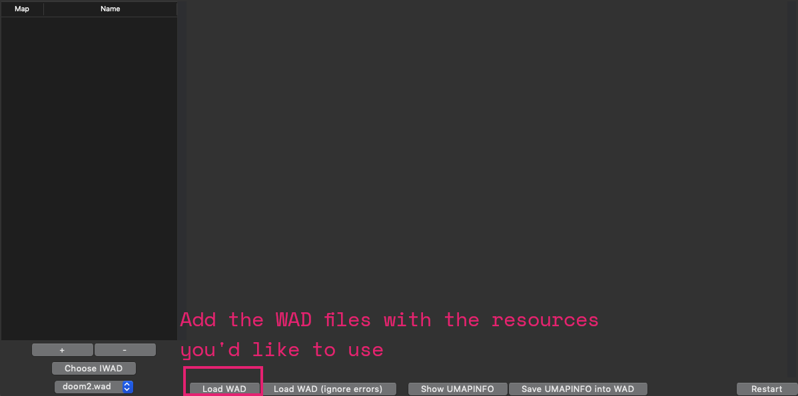
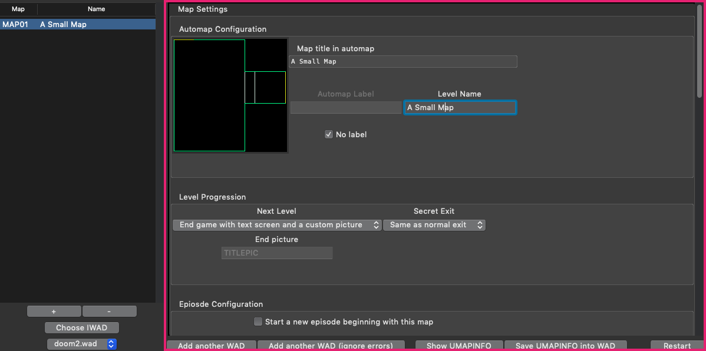

# UMAPINFO Designer

UMAPINFO Designer helps you create UMAPINFO for WAD files.

This will help you customize gameplay in a way that is supported by many game ports.

The goal of this program is to demystify UMAPINFO's many options, what they do, and how they will affect gameplay in your WAD.

**UMAPINFO Designer is in early development -- please back up your data!**

# Installing

A Windows executable is provided, built with [pyinstaller](https://pyinstaller.readthedocs.io/).

If you wish to run the program yourself, clone this repository and install the dependencies. Python 3.5+ is required.

From the directory where you cloned this repository, run the following:

```
pip install pyttk pillow omgifol

python -m UMAPINFODesigner
```

# How To Use

On the first launch, you will be guided to add the IWAD file for the base game you'll be working with. UMAPINFO Designer needs this to pull in the base resources that will be made available to you while you design your UMAPINFO.

You can add more IWADs later and switch between them using the drop-down menu in the lower-left corner of the program.


## Add your WAD(s)

Load any WAD(s) that contain the data you want to make available while designing your UMAPINFO. This could be music, graphics, textures, maps, etc.

You can press the "Load WAD" button multiple times to accumulate many WADs.

Note that if any loaded WAD contains a UMAPINFO, it will be loaded as well.



## Add your map(s)

UMAPINFO let you customize each map independently. Add the maps using the "+" button. Remove maps with the "-" button.

<font color=red>Warning</font>: There is no undo when you remove a map!


## Customize your map(s)

Use the Map Configuration pane to customize the map to your liking. There are various sections inside the Map Configuration frame which allow customizations. Important notes may appear as you make changes.

If a mistake is detected, it will be shown as a pop-up message.



### Warnings

**Warnings** are potential issues that UMAPINFO Designer will notify you about but will not prevent you from doing.

They will have a warning sign icon.

```
⚠️
```

### Errors

**Errors** are issues that UMAPINFO Designer can't fix for you. The action that was taken won't be allowed to proceed.

```
❌
```

## Save your UMAPINFO

Once you're done customizing, it's time to export your UMAPINFO.

There are two choices:

1. **Manual**: Press the "Show UMAPINFO" button. Copy and paste the content into your WAD in a lump named "UMAPINFO" and save it there.
2. **Automatic**: Press the "Save into WAD" button. Save into an existing or create a new WAD and the UMAPINFO lump will be created there for you.
    * <font color=red>Back up your content first! Don't save into an existing WAD that is not backed up!</font>

<font color=red>Warning: If you quit without saving, your UMAPINFO will be lost!</font>


# License

This program is free software: you can redistribute it and/or modify
it under the terms of the GNU General Public License as published by
the Free Software Foundation, either version 3 of the License, or
(at your option) any later version.

This program is distributed in the hope that it will be useful,
but WITHOUT ANY WARRANTY; without even the implied warranty of
MERCHANTABILITY or FITNESS FOR A PARTICULAR PURPOSE.  See the
GNU General Public License for more details.

You should have received a copy of the GNU General Public License
along with this program.  If not, see [https://www.gnu.org/licenses/](https://www.gnu.org/licenses/).
